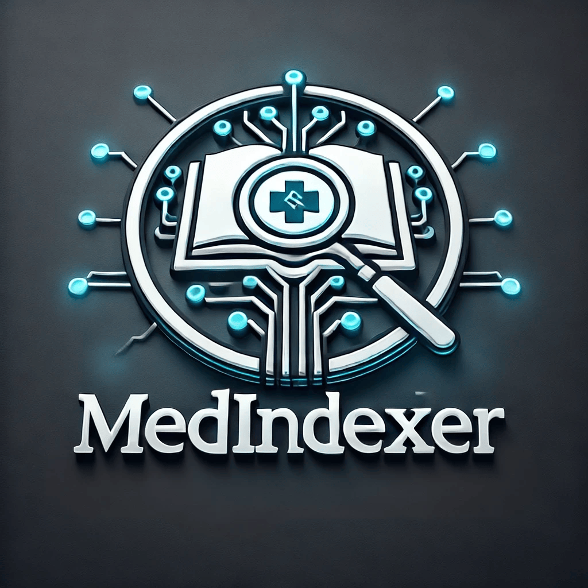

<!-- markdownlint-disable MD033 -->

# MedIndexer: AI-Powered Clinical Knowledge Base Framework  

> This project is **part of the [HLS Ignited Program](https://github.com/microsoft/aihlsIgnited)**, which focuses on hands-on projects that show how AI is transforming the healthcare industry. In this project, we empower healthcare providers and payor organizations to build **AI-driven clinical knowledge bases** using **Azure AI Search**. Please visit the program page to explore the full program and its projects.

**MedIndexer** is a **indexing framework** designed for the **automated creation of structured knowledge bases** from clinical and policy-related documents. It enables the transformation of **clinical notes and policy documentation** into a **schema-driven, searchable format**, allowing your applications to leverage **state-of-the-art retrieval methodologies**, including **vector search and re-ranking**, seamlessly integrated with **Azure AI Search**. By applying a **well-defined schema** for data organization and vectorizing the data into a **higher-dimensional representation**, MedIndexer empowers AI applications to retrieve **more precise and context-aware information**.

- **Schema-Based Knowledge Structuring**: Converts **clinical and policy documents** into a **schema-driven format**, ensuring structured and efficient retrieval while applying **vectorization techniques** to encode document semantics in high-dimensional space.
- **Seamless Azure AI Search Integration**: Optimized for **scalability, speed, and precision retrieval**, leveraging **vector embeddings, hybrid search, and re-ranking**.
- **Dimensionality Expansion for Advanced Retrieval**: Vectorized indexing transforms text into a **multi-dimensional representation**, enabling **context-aware retrieval, similarity-based ranking, and advanced filtering**.
- **Automated Metadata Extraction**: Dynamically **identifies, enriches, and categorizes** key information from documents, improving **search relevance** and allowing for **faceted filtering**.
- **Structured and Semantic Querying**: Supports **SQL-style filtering** alongside **vector-based semantic retrieval**, bridging **structured and unstructured data retrieval** methodologies.

### Disclaimer

> [!IMPORTANT]
> This software is provided for demonstration purposes only. It is not intended to be relied upon for any purpose. The creators of this software make no representations or warranties of any kind, express or implied, about the completeness, accuracy, reliability, suitability or availability with respect to the software or the information, products, services, or related graphics contained in the software for any purpose. Any reliance you place on such information is therefore strictly at your own risk.
